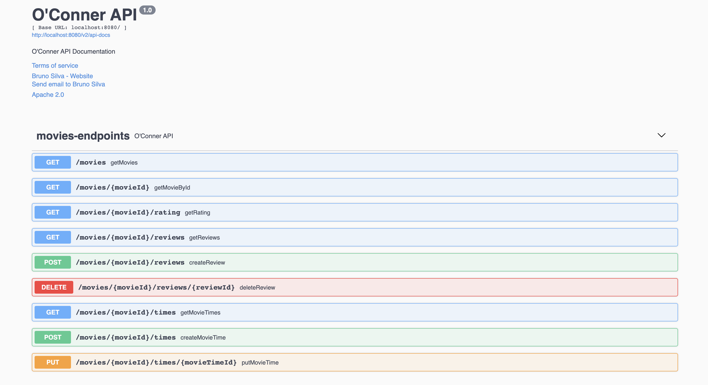

# O'Conner API

This project is a simple API with a movie catalog, movie details, reviews, and movie times.

## Technologies

I made decisions here to make a code easy to read and simple to run.

First, this project was created using: https://start.spring.io/

And it uses the main following technologies:
- JVM (minimum version 11)
- Kotlin
- SpringBoot 2.5.5
- MongoDB
- JUnit 5
- Mockk
- Swagger

## Technical Considerations

Two important decisions here were the language and the database. I choose to use kotlin because I believe It is the best JVM language nowadays.
Kotlin is very easy to make an immutable code and is enjoyable to work with its collections.

The database I choose to use is MongoDB because it is flexible and powerful, and I think it supports well this use case.

## Setup

To build and run this project it is required to install **Java** and **Docker**.
I strongly recommend installing Java using sdkman https://sdkman.io/, using the following command:
```sh
sdk install java 17-open
```
For docker please follow their installation guide: https://docs.docker.com/engine/install/

## Build and Running

I created two scripts helper: 
- [start.sh](/scripts/start.sh)
- [stop.sh](/scripts/stop.sh)

So, to run the application you only need to enter in `/scripts` directory and run `./start.sh <omdbapi_key>`

Steps of the script:
- Build the application using maven 
- Create a docker image using maven + spring-boot 
- Starts image of mongodb
- Starts image of `oconner-api`

If you need to see the logs you can use this command `docker-compose logs api-oconner`

## How it works

The api has a basic documentation of all endpoints, to see that access this route:
`http://localhost:8080/swagger-ui/#/movies-endpoints`



The first endpoint will show you the catalog movies and is already populated in the application startup.
With a movie id, you can do all the other operations.

## Next steps

- Security:
  - Authentication
  - Authorization - ROLES for admins and customers.
  - Another api only with this responsibility.
- HATEOAS - I created and documented the endpoints thinking in their relationship, I think if I can provide hateoas references it will be helpful to clients consume this api.
- CircuitBreaker - use resilience4j with webClient
- Features: 
  - Create Movies
  - Delete Movies
  - Update Review
  - Delete Review
  - Delete MovieTime
